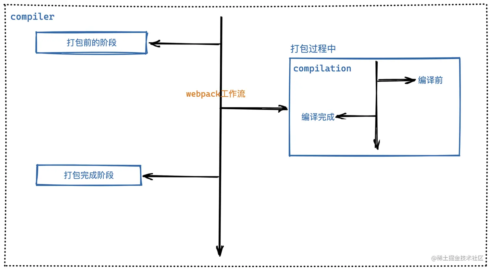

# webpack 构建流程

## 一 初始化
1. 读取默认配置文件 `webpack.config.js`, 主要包含 入口（`entry`）; 文件路径指向（`resolve.alias`）; 生成文件的路径与名称 (`output`); 处理各个模块的loader (`module.loaders`); 插件(`plugins`)
2. 读取默认配置项拷贝到`options`对象中，加载用户配置的 `plugins`
3. 初始化编译对象 `Compiler`, 他不执行具体的任务，只是进行一些调度工作

## 二 编译
初始化完成后会调用 `compiler`对象的`run`方法开始编译，主要流程如下：
1. `compile` 开始编译
2. `make` 从入口点开始分析模块以及模块的依赖，创建这些模块对象
3. `build-module` 构建模块
4. `seal` 封装构建结构
5. `emit` 把各个`chunk`输出到结果文件

## 三 输出

在webpack源码中，`compiler`包含上面3个阶段，在他身上挂载着各种生命周期钩子。`compilation` 主要负责编译相关工作。

## 整体实现流程：
1. 读取配置参数
2. 用配置参数初始化`Compiler`对象
3. 挂载配置文件中的插件
4. 执行 `compiler` 实例上的 `run` 方法
5. 根据配置对象中的 `entry` 配置项找到所有入口
6. 从入口出发，调用配置的 `loader` 对各个模块进行编译
7. 找出该模块依赖的模块，再对依赖的模块进行编译
8. 等所有模块编译完成后，根据模块之间的依赖关系，组装代码块 `chunk`
9. 把各个代码块 `chunk` 转换成一个个文件加入到输出列表
10. 确定好输出内容后，根据配置好的输出路径和文件名，将文件内容写入到文件系统。
