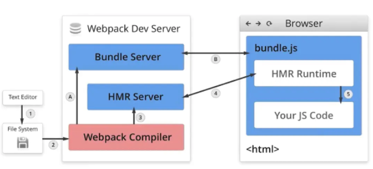

# webpack 热更新原理

### 启动阶段
1. 编辑文件
2. 保存
3. webpack 编译
4. 生成bundle.js文件，`bundle Server`提供静态资源访问

### 更新阶段

1. 编辑文件
2. 保存文件
3. webpack 编译, 生成唯一的hash值，作为下次更新的标识
4. 传递给 `HMR Server`，通过soket向浏览器端推送一条更新消息。 浏览器根据对应的`hash`去请求更新js文件。