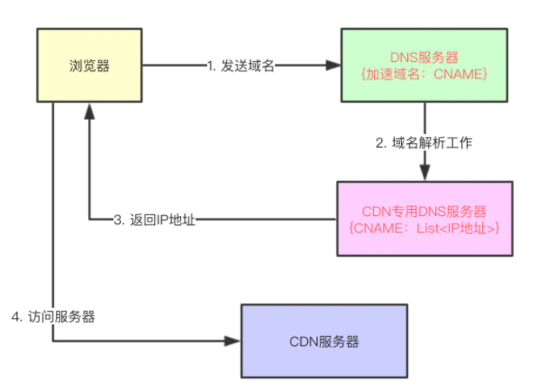

# 什么是CDN，说说其实现原理

cdn即内容分发网络，根据用户位置分配最近的资源

没有使用cdn时访问站点的路径：
> 用户提交域名 -> 浏览器对域名进行解析 -> DNS 解析得到目的主机的ip地址 -> 根据ip访问发出请求 -> 得到请求数据

应用CDN后，DNS 返回的不再是 IP 地址，而是一个`CNAME(Canonical Name )` 别名记录，指向CDN的全局负载均衡

### 缓存代理
缓存系统是 CDN的另一个关键组成部分，缓存系统会有选择地缓存那些最常用的那些资源

其中有两个衡量CDN服务质量的指标：

- 命中率：用户访问的资源恰好在缓存系统里，可以直接返回给用户，命中次数与所有访问次数之比
- 回源率：缓存里没有，必须用代理的方式回源站取，回源次数与所有访问次数之比
缓存系统也可以划分出层次，分成一级缓存节点和二级缓存节点。一级缓存配置高一些，直连源站，二级缓存配置低一些，直连用户

回源的时候二级缓存只找一级缓存，一级缓存没有才回源站，可以有效地减少真正的回源

现在的商业 CDN命中率都在 90% 以上，相当于把源站的服务能力放大了 10 倍以上
